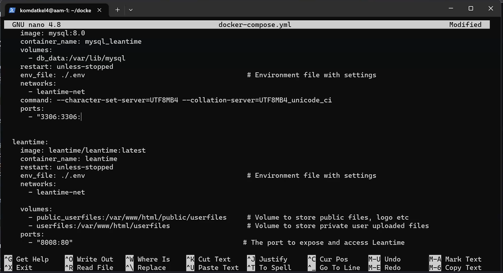
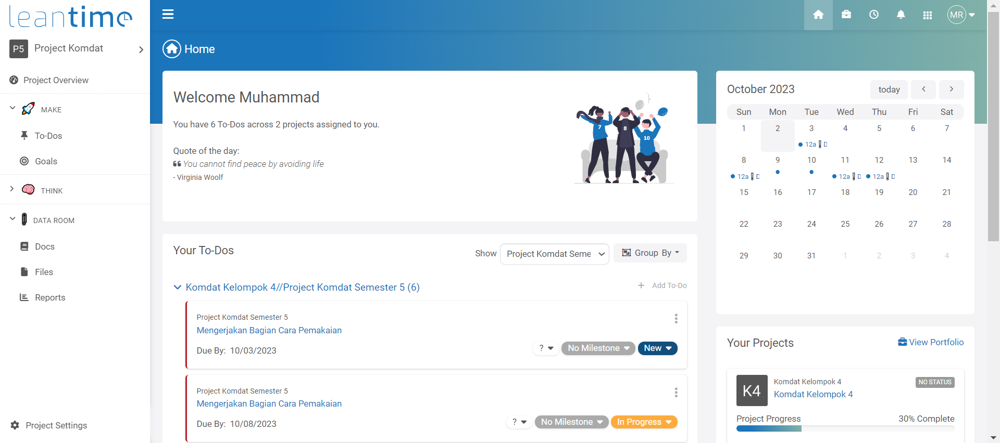
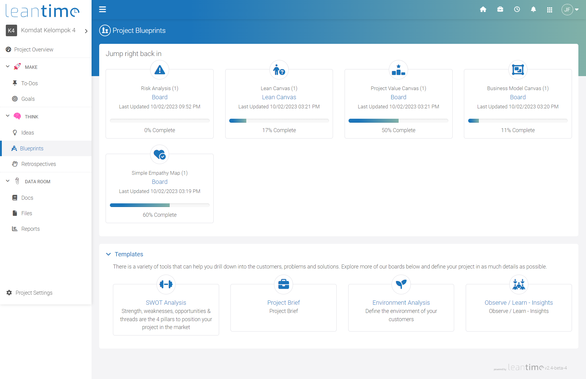
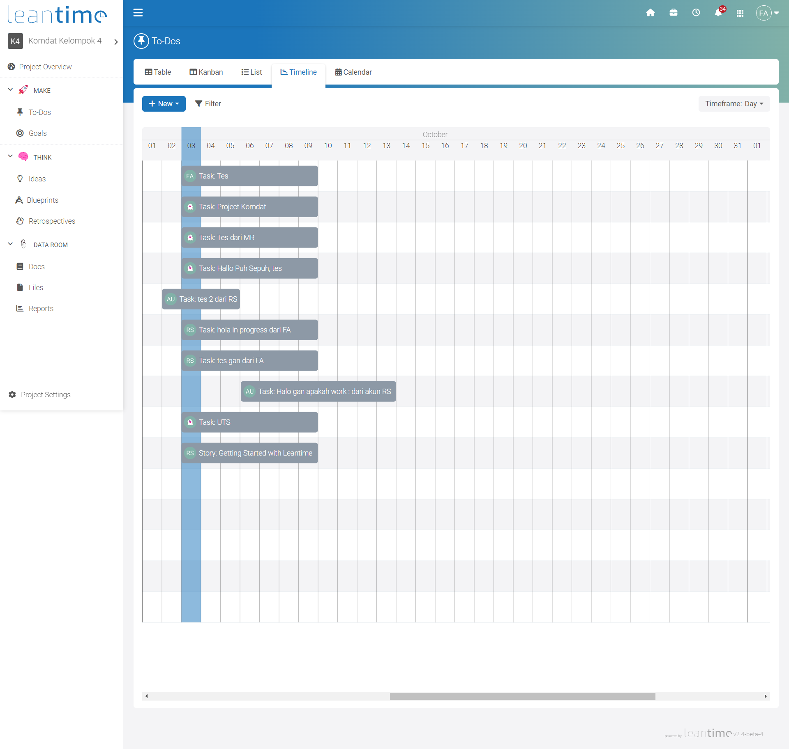

# ProjectKomdat
Tugas Projek sesi UTS mata kuliah Komdat kelompok 4, Dapat diakses di http://34.101.90.55:8008/

Masuk dengan akun guest:
- Guest Editor : guest1@gmail.com | Guest1--
- Guest Read Only : guest2@gmail.com | Guest2--


# Aplikasi Web Leantime

<h1 align="center">  </h1>

[Sekilas Tentang](#sekilas-tentang) | [Instalasi](#instalasi) | [Konfigurasi](#konfigurasi) | [Otomatisasi](#otomatisasi) | [Cara Pemakaian](#cara-pemakaian) | [Pembahasan](#pembahasan) | [Referensi](#referensi)
:---:|:---:|:---:|:---:|:---:|:---:|:---:

# Sekilas Tentang

Leantime adalah **strategic open source projet management** yang berfokus untuk membantu perusahaan dan tim yang ingin membuat project management dari awal hingga akhir. Leantime dibuat untuk non-project manager, Leantime menggabungkan perencanaan serta pekerjaan sekaligus sehingga mudah diakses dan digunakan oleh semua orang dalam tim. Leantime merupakan alternatif serta gabungan dari ClickUp, Monday, Asana, dan Trello.


# Instalasi

## Kebutuhan Sistem
- PHP 8.0+
- Web Server (Kami menggunakan Google Cloud Virtual Machine)
- MySQL 5.7+

## Langkah Instalasi

### 1. Login kedalam server menggunakan ssh
```
ssh komdatkel4@34.101.90.55
```

### 2. Instalasi terbagi 2, pertama instan menggunakan docker compose dan template yang sudah disediakan, dan yang kedua menggunakan docker run serta manual untuk mengatur databasenya

#### Cara Pertama menggunakan docker compose
```
git clone https://github.com/Leantime/docker-leantime.git
cd docker-leantime
cp sample.env .env
```
buka file .env untuk mengatur konfigurasi Leantime
```
nano .env
```
disini kita bisa mengubah pengaturan database & container


lalu build
```
docker compose up --build
```
jika terdapat masalah tidak bisa menyambung kedalam database lakukan
```
docker compose down -v
```
 <br />
lalu build kembali

#### Cara kedua menggunakan docker run
buat network agar leantime dapat tersambung dengan container MySQL
```
docker network create leantime-net
```
buatlah database MySQL, ubahlah sesuai yang diinginkan
```
docker run -d --restart unless-stopped -p 3306:3306 --network leantime-net \
-e MYSQL_ROOT_PASSWORD=321.qwerty \
-e MYSQL_DATABASE=leantime \
-e MYSQL_USER=admin \
-e MYSQL_PASSWORD=321.qwerty \
--name mysql_leantime mysql:8.0 --character-set-server=UTF8MB4 --collation-server=UTF8MB4_unicode_ci
```
buatlah container untuk leantime
```
docker run -d --restart unless-stopped -p 80:80 --network leantime-net \
-e LEAN_DB_HOST=mysql_leantime \
-e LEAN_DB_USER=admin \
-e LEAN_DB_PASSWORD=321.qwerty \
-e LEAN_DB_DATABASE=leantime \
--name leantime leantime/leantime:latest
```
jalankan instalasi dengan `domain.com/install`


### 3. Pengaturan port yang diinginkan
ubah isi dari docker-compose.yml
```
nano docker-compose.yml
```
- ganti ports pada bagian leantime menjadi yang diinginkan, semisalnya **"8008:80"** atau "80:80" <br />
- buat ports pada bagian services, masukkan **"3306:3006"** agar memastikan database tersambung <br />



### 4. Instalasi WebApp
saat kita membuka web pertama kali, yang akan muncul adalah instalasi untuk akun dari admin <br />
silahkan isi sesuai yang diinginkan, setelahnya akan diarahkan kedalam page login dan semua instalasi telah **selesai** <br />


# Konfigurasi

Config tambahan seperti sitename, bahasa, dan timezone
- Config dapat dilakukan dengan mengubah isi dari .env yang telah di copy sebelumnya
  ```
  nano .env
  ```

  

SMTP Config
- Leantime mensupport pengiriman email menggunakan SMTP, cukup ubah pada .env
  ```
  nano .env
  ```

  

Create Account untuk user lain
- As admin, pergi kedalam opsi user management, disini kita bisa melihat semua user, mengatur semuanya, dan mendaftarkan yang baru

  

- Pilih add user dan setting user baru sesuai yang diinginkan, serta role sang user

  

- Akan ada invitation link yang berisikan pengaturan password untuk akun baru

  


# Otomatisasi
- Hidupkan server menggunakan docker
  ```
  docker-compose up -d
  ```
- Matikan server yang sedang berjalan
  ```
  docker-compose down
  ```


# Cara Pemakaian
Penggunaan **PM Leantime** sangat simpel, karena aplikasi ini dilengkapi dengan antarmuka yang sederhana dan mudah dipahami. Berikut ini untuk penjelasan lebih lanjut:

1. Sebelum menggunakan Leantime, kita harus login pada halaman login Leantime.
   
   

2. Setelah login, kita akan masuk ke halaman **Home**. Di sini kita bisa melihat To-Dos, Kalender, dan Project kita.  
   
   
   
1. Menu **Project Overview/Dasboard**. Fitur ini memberikan visibilitas proyek kepada semua pihak dengan Project Checklist, Latest To-Dos, Daftar team proyek, Project progress Diagram, dan Project Updates, Milestones Proyek.
   
   
   
3. Menu **Make**. Fitur ini berisi:
   
   a. **Fitur To Dos**. Fitur ini berguna untuk mengatur, melacak, dan mengelola pekerjaan atau tugas dengan tingkat prioritas dan batas waktu. Fitur ini memiliki beberapa tampilan yaitu Table, Kanban, List, Timeline, dan Calendar.
   
    - **Table View**
    

    - **Kanban View**
    
   
   b. **Fitur Goals**. Fitur ini digunakan untuk menetapkan tujuan, mengukur kemajuan terhadap tujuan tersebut, dan melihat pencapaian tujuan dengan adanya progress bar serta informasi status tujuan tersebut (On track, Risk, atau Miss).

    
   
5. Menu **Think**. Fitur ini berisi:
  
   a. **Fitur Ideas**. Fitur ini untuk membuat, menyimpan, dan mengembangkan ide dalam proyek dengan dua tampilan yaitu Idea Wall dan Idea Kanban. 

      - **Idea Wall**
      

      - **Idea Kanban**
      

   b. **Fitur Blueprints**. Fitur ini digunakan untuk merancang dan merencanakan proyek. Dengan beberapa template yang tersedia, tim dapat menelusuri pelanggan, masalah, dan solusi sehingga dapat merencanakan pelaksanaan proyek secara rinci.

      - **Project Blueprints**
      

      - **Lean Canvas Board pada Project Blueprints**
      

   c. **Fitur Retrospectives**. Fitur ini berguna untuk merefleksikan kinerja proyek, mengevaluasi pencapaian, dan mengidentifikasi pelajaran untuk perbaikan selanjutnya melalui retrospektif tim proyek.
   
      
   
6. Menu **Data Room**. Fitur ini berisi:
   
   a. **Fitur Docs**. Fitur ini mengelola dan menyimpan dokumen proyek, memudahkan akses dan kerja sama tim dalam pengembangan dan pelaksanaan proyek dengan mengunggah, mengedit, dan berbagi dokumen.

      

   b. **Fitur Files**. Fitur ini adalah tempat untuk mengelola berkas digital, seperti gambar, video, dan lainnya. Fitur ini memungkinkan untuk mengunggah file, menyimpan file, mengatur file, hingga perekaman video atau layar secara langsung.

      

   c. **Fitur Reports**. Fitur ini berisi laporan proyek seperti Summary, Sprint Burndown, Cumulative Flow, dan Project Progress yang dapat membantu tim dalam memantau kemajuan proyek dan pengambilan keputusan yang tepat.

      
   
7. Pada bagian pojok kanan atas, terdapat beberapa fitur yang dapat kita gunakan. Fitur **My Profile** digunakan untuk melihat account settings berupa informasi profil, 
   keamanan, look and feel, dan notifikasi.

   

8. **Fitur My Project** digunakan untuk melihat project apa saja yang kita miliki.

   
   
9. Fitur **Company**. Pada fitur ini, terdapat beberapa pilihan yaitu All Timesheets berguna untuk melihat keseluruhan waktu/jam yang sudah digunakan, All Projects 
   berguna untuk melihat keseluruhan project yang ada, All client berguna untuk melihat nama klien, dan User Management berguna untuk melihat ada berapa user atau pengguna 
   website Leantime.

   

10. Fitur **Notification** digunakan untuk melihat notifikasi dan mention yang masuk.

      
   
   
# Pembahasan

Leantime sebagai alat yang dirancang untuk mengelola proyek dengan lebih efektif dan efisien, memiliki beberapa kelebihan dan kekurangan sebagai berikut
  
  **Kelebihan**
  1. Antarmuka pengguna yang ramah
     - Leantime memiliki antar pengguna yang bersih dan mudah digunakan sehingga memudahkan pengguna baru dalam menggunakan aplikasi ini.
       
       
  
  2. Manajemen tugas yang baik
     - Aplikasi Leantime memungkinkan tim untuk membuat, mengedit, dan mengatur tugas-tugas proyek yang ada sehingga dapat mengikuti perkembangan progress dengan baik.

  3. Bisa membantu memperkirakan biaya proyek atau produktivitas dengan fitur pelacakan waktu
     - Terdapat fitur pelacakan waktu yang memungkinkan tim untuk mencatat jam kerja mereka pada proyek-proyek tertentu. Hal ini bisa membantu perhitungan upah serta memantau efisiensi dan efektivitas pekerjaan.

       

  4. Pelaporan dan analisis
     - Leantime dapat memberikan laporan proyek dengan mudah. Sehingga bisa membantu dalam pemantauan dan analisis kinerja proyek.

       


  **Kekurangan**
  1. Terbatasnya versi gratis
     - Leantime memiliki versi gratis, namun memiliki keterbatasan jumlah pengguna, proyek, serta fitur yang dapat digunakan. Untuk menggunakan fitur yang lebih canggih, kita perlu berlangganan dengan incian harga sebagai berikut

       
       
  2. Kurangnya integrasi
     - Leantime nelum bisa banyak melakukan integrasi dengan alat – alat yang lain seperti mengimport fitur tambahan dari luar aplikasi. Beberapa alat tambahan yang bisa digunakan dari luar yaitu Google Calendar dan Slack.
       
  3. Tidak disediakannya template manajemen proyek yang bisa digunakan
     - Berbeda dengan beberapa aplikasi manajemen yang populer, pilihan template projek tidak disediakan pada aplikasi Leantime.
       
  4. Belum tersedianya versi mobile
     - Hingga saat ini, Leantime hanya tersedia pada Windows, Mac, Linux, Saas/Web, dan On-Premises. Aplikasi ini belum support pada device mobile seperti Android dan IOS.
    


  **Aplikasi serupa**
  
  Pada kali ini, kami ingin membandingkan fitur yang dimiliki Leantime dengan oleh Trello dan Zoho. Beberapa fitur yang sama-sama dimiliki oleh ketiga aplikasi tersebut meliputi pelacakan tugas, tenggat waktu, progress proyek, dan kolaborasi dengan tim. Namun jika ditelaah lebih lanjut, terdapat beberapa perbedaan yang menjadi kelebihan dan kekurangan tiap aplikasi. Berikut uraiannya.
  
  1. Trello memiliki fitur otomatisasi proyek yang disebut Butler
     - Butler adalah fitur otomatisasi proyek yang dapat membantu pengguna Trello dengan tugas-tugas berulang. Tugas tersebut dapat berupa memindahkan kartu, menambahkan komentar, mengubah tanggal tenggat waktu, mengiri email, menambahkkan label, dan yang lainnya. Fitur ini tidak bisa didapatkan pada Leantime.

       

  2. Trello memberkan project template kepada penggunanya
     - Berbeda dengan Leantime, Trello memberikan beberapa template project kepada penggunanya. Fitur ini tidak bisa ditemukan pada Leantime sehingga pengguna perlu menyusun dari awal tampilan manajemen proyeknya.
    
       

  3. Zoho memiliki integrasi yang lebih beragam dari pada Leantime
     - Beberapa alat tambahan yang bisa digunakan dalam zoho seperti Github, Google Calendar, Slack, Microsoft Onedrive, Microsoft Teams, dan lain-lain.

        

  4. Zoho tidak menawarkan API seperti Leantime
     - API (Application Programming Interface) pada Leantime adalah sekumpulan fungsi yang dapat digunakan untuk berinteraksi dengan data Leantime dari aplikasi pihak ketiga. API Leantime memungkinkan pengguna untuk mengakses data Leantime, seperti proyek, tugas, dan catatan, untuk tujuan integrasi, pengembangan, dan otomatisasi. Ada dua cara untuk menggunakan API Leantime, yaitu melalui HTTP dan SDK.
       


## Referensi


1. [Leantime](https://leantime.io/) - Website Leantime
2. [Trello](https://trello.com/) - Website Trello
3. [Zoho](https://projects.zoho.com/) - Website Zoho Projects 
4. [Saasworthy](https://www.saasworthy.com/compare/trello-vs-openproject-vs-leantime?pIds=146,2507,2592) - Compare between Trello and Leantime
5. [Sourceforget](https://sourceforge.net/software/compare/ClickUp-vs-Leantime-vs-Zoho-Projects/) - Compare between Zoho and Leantime
